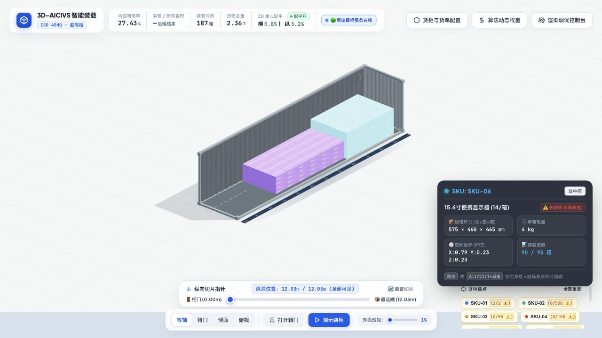
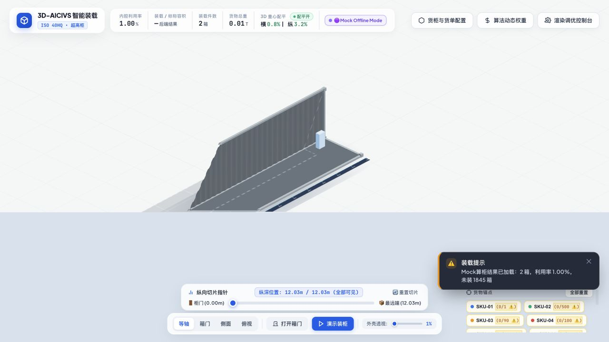
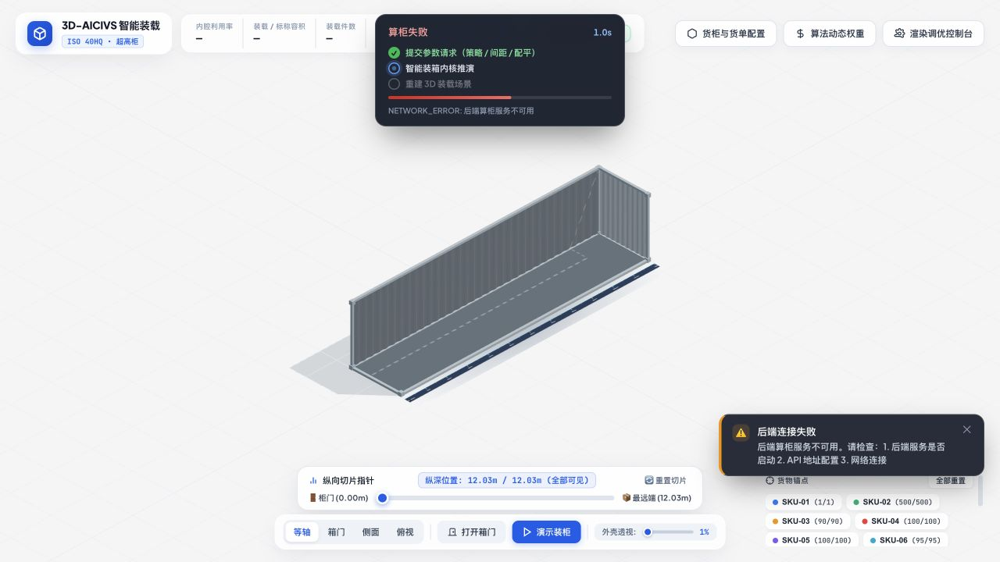

# BLK-007D Screenshot Evidence

## Backend Mode

The default page created a backend job, fetched a BLK007C LoadingResult, showed the online badge, and rendered backend cargo in the existing Three.js scene.



## Explicit Mock Offline Mode

The same renderer consumed `frontend/mock/demo_loading_result.json` only under `?mode=mock`.



## Backend Offline

With only the static frontend running, the UI showed the red offline state and actionable error. No local solver was invoked and no stale KPI was retained.



```text
BLK007D_STATUS = PASS
BACKEND_RENDERING_READY = true
NEXT_STAGE = BLK008
```
