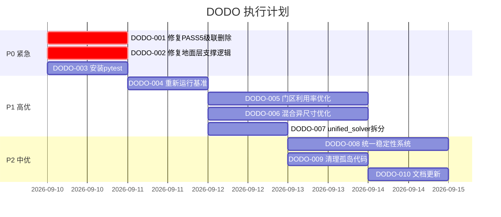

# DODO.MD — 开发待办与优先级路线图

> 本文档是 3D-AICIVS 项目的动态待办清单和开发路线图。
> 基于 2026-09-09 全盘审查结果编制。

---

## 当前基准（2026-09-09）

| 用例 | 放入/请求 | 利用率 | Violations |
|:---|:---:|:---:|:---:|
| 14-SKU-1845 | 2092/2145 | 88.02% | 0 |
| 单一大箱 | 60/70 | 91.46% | 0 |
| 全弹性件 | 1026/3200 | 86.05% | 0 |
| 门区密集 | 980/980 | 69.75% | 0 |
| 混合异尺寸 | 810/810 | 70.43% | 0 |

> ⚠️ 以上为 OPT-05 后数据。TIP 修复后未重新测量。

---

## 🔴 P0 — 紧急修复（必须在下一轮开发前完成）

### DODO-000: 消除刚性SKU饥饿弃装与弹性倒挂 (Priority Inversion & Starvation)
- **角色**: 算法工程师
- **问题**: 在最新多维合规审计中发现，14-SKU 等用例虽然利用率达 86.33%，但刚性履行率仅 84.66%，且出现严重弃装（如 `SKU-12` 仅1件被彻底放弃为0件，`SKU-14` 丢弃近半）。算法在生成切片时抛弃零散小件，并存在提前塞入弹性件刷分的隐患。
- **方案**: 
  1. 在 `WidthPatternEngine` 和 `_solve_single_trial` 前期引入“尾数零散件优先强制配对锚定”机制，严禁遗漏任何 `required > 0` 的刚性件；
  2. 严格限制弹性件装入时机：刚性 SKU 履行率未达标前，禁止调用弹性件条带。
- **文件**: `backend/solver_v2/solver/unified_solver.py`, `backend/solver_v2/solver/composite_strip.py`
- **验收**: 刚性 SKU 履行率提升至 98%+，`starved_skus` 严格为 0，健康状态消除 `SKU_STARVATION` 与 `PRIORITY_INVERSION`。
- **预估**: 0.5 天

### DODO-001: 修复 PASS5 倾覆审计的级联删除
- **角色**: 稳定性工程师
- **问题**: `tipping_moment.py` 的 `audit_and_repair()` 会删除箱子，导致级联失稳、空腔和悬浮
- **方案**: 
  - 方案 A（推荐）：完全移除 PASS5 的删除逻辑，改为在 PASS1 放置时通过 `_is_placement_tipping_safe()` 预检
  - 方案 B：保留 PASS5 但限制最多删除 3 箱，超过则放弃修复
- **文件**: `stability/tipping_moment.py`, `unified_solver.py` L1358-1373
- **验收**: 利用率恢复到 85%+，无空腔，无悬浮
- **预估**: 0.5 天

### DODO-002: 修复地面层 _has_sufficient_support 逻辑
- **角色**: 稳定性工程师
- **问题**: 当前 `_has_sufficient_support` 对地面层 (z<1e-3) 直接返回 True，但如果之前的实现将 lateral check 嵌入其中，会阻止地面层放置
- **方案**: 确认当前 L1707-1708 `return True` 是否生效。如果被其他逻辑覆盖，修复
- **文件**: `unified_solver.py` L1706-1749
- **验收**: 地面层所有 SKU 可正常放置
- **预估**: 2 小时

### DODO-003: 安装 pytest 并验证测试套件
- **角色**: 测试工程师
- **问题**: `python -m pytest` 报 `No module named pytest`，73 个测试无法执行
- **方案**: `pip install pytest pytest-timeout` + 修复失败的测试
- **验收**: `pytest tests/ -x --tb=short` 至少 80% 通过
- **预估**: 2 小时

---

## 🟡 P1 — 高优先级（本周内）

### DODO-004: 重新运行基准并更新 benchmark_results.json
- **角色**: 测试工程师
- **前置**: DODO-001 完成
- **方案**: 运行 `tests/benchmark_suite.py`，将结果写入 `benchmark_results.json`
- **预估**: 1 小时

### DODO-005: 门区利用率优化（69.75% → 80%+）
- **角色**: 算法工程师
- **问题**: 门区密集场景仅 69.75%，所有箱已放入但空间浪费大
- **方向**:
  - 门区 SKU 的朝向选择优化（增加 flat/side 候选）
  - 门区截面的 Y 方向密实排列
  - 门区微块扩展的 max_rows/max_lz 参数调优
- **文件**: `unified_solver.py` PASS1 门区逻辑 + `composite_strip.py`
- **验收**: 门区利用率 ≥ 78%，其他场景不退化
- **预估**: 2 天

### DODO-006: 混合异尺寸利用率优化（70.43% → 80%+）
- **角色**: 算法工程师
- **问题**: 5 种不同尺寸 SKU 的排列组合未充分利用空间
- **方向**:
  - 改进 PASS4 回填对异尺寸的候选生成
  - 增加"大箱底层+小箱顶层"的混合策略
- **预估**: 2 天

### DODO-007: unified_solver.py 拆分（1777行 → 5 个模块）
- **角色**: 架构审计 + 算法工程师协同
- **方案**:
  ```
  unified_solver.py (350行) — solve() 入口 + 试算策略管理
  wall_builder.py (400行)   — PASS1 墙构建 + headroom relay
  cavity_filler.py (300行)  — PASS4 回填
  stability_gate.py (400行) — 所有稳定性检查方法
  geometry_utils.py (150行) — 凸包、点段距离等几何工具
  ```
- **前置**: DODO-001, DODO-004 完成
- **验收**: 拆分后所有基准不变
- **预估**: 1 天

---

## 🟢 P2 — 中优先级（本月内）

### DODO-008: 统一稳定性系统
- **角色**: 稳定性工程师 + 架构审计
- **问题**: stability/ 包有 6 个模块（item_stability, wall_stability 等），但 unified_solver 自己又实现了一套
- **方案**: 将 unified_solver 内联的稳定性检查迁移到 stability/ 包，统一参数和接口
- **预估**: 2 天

### DODO-009: 清理孤岛代码（~375KB）
- **角色**: 架构审计
- **方案**: 
  1. 标记所有未被调用的模块
  2. 移入 `_archive/` 目录（不删除，保留备用）
  3. 或添加 `# STATUS: ORPHANED` 标记
- **预估**: 1 天

### DODO-010: 文档更新
- **角色**: 架构审计
- **问题**: 7/12 个文档描述旧架构（search engine 驱动 vs 当前 unified_solver 直接驱动）
- **方案**: 重写以下文档
  - SOLVER_V2_ARCHITECTURE.md — 反映当前 PASS1-5 架构
  - ALGORITHM_RUNTIME_FLOW.md — 反映当前试算+贪心流程
  - STABILITY_AND_PHYSICS.md — 反映当前稳定性检查机制
- **预估**: 1 天

### DODO-011: 前端工程化
- **角色**: 前端工程师
- **方案**:
  - 添加 Vite 或 esbuild 构建工具
  - 添加 ESLint 检查
  - 组件模块化
- **预估**: 2 天

---

## 🔵 P3 — 低优先级（后续迭代）

### DODO-012: 激活 HierarchicalSearchSolver
- **问题**: search/engine.py (36KB) + beam.py (63KB) 实现了完整的搜索框架，但当前未使用
- **方向**: 评估是否将 search engine 作为 unified_solver 的上层调度器
- **预估**: 1 周

### DODO-013: 生产化（FastAPI + CI/CD）
- **方案**:
  - 从 `http.server` 迁移到 FastAPI
  - GitHub Actions CI/CD
  - Docker 化
- **预估**: 1 周

### DODO-014: 真实客户数据验证
- **方案**: 收集 20+ 真实订单数据，建立回归测试集
- **预估**: 持续

---

## 执行顺序



---

## 变更日志

| 日期 | 变更 | 操作人 |
|:---|:---|:---|
| 2026-09-09 | 初始版本，基于全盘审查结果编制 | 审查 Agent |
